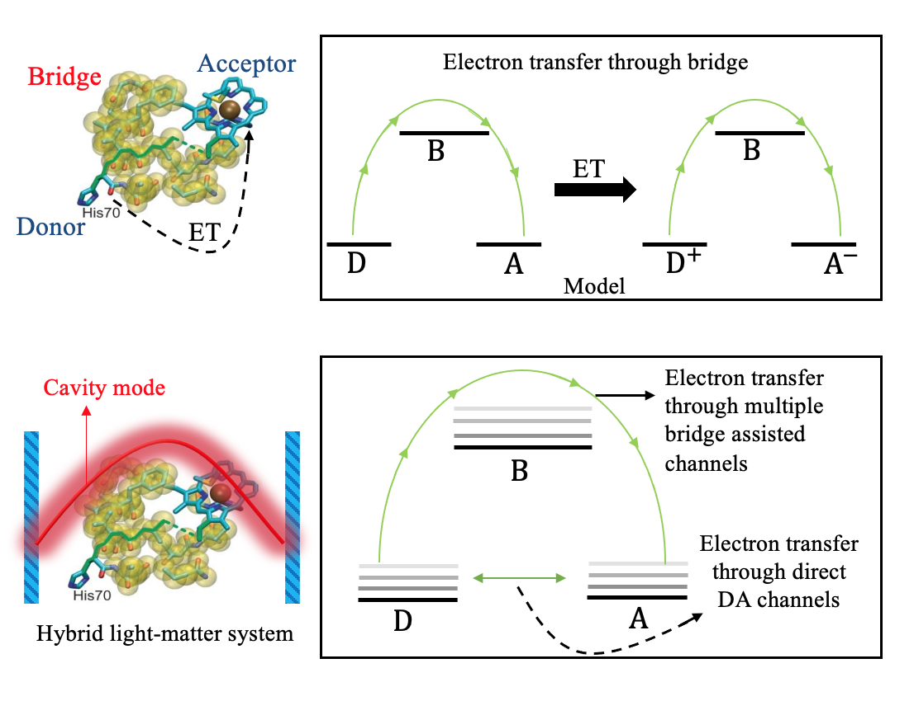

# Cavity Induced Interfering Electron Transfer Pathways for Donor(D)-Bridge(B)-Acceptor(A) Systems
S. N. Chowdhury.

**Introduction:**

Tuning chemical reactivity by coupling molecular system to a photon field in an optical cavity has emerged as an exciting method beyond the traditional paradigms of chemistry[1–13]. Theoretical investigations have played an important role in uncovering the underlying principles of the cavity quantum-electrodynamics (cQED) process that enable new reactivities in a photon-molecule hybrid system inside an optical cavity[4–9, 11–22]. Despite encouraging progress, simulating and understanding the underlying phenomena of such molecular system that is coupled to a quantized photon mode in an optical cavity remains a challenging task. 

DBA is a prototype model for the Macromolecular Electron transfer systems such as protein complexes or DNA. The Underlying electron transfer mechanism for these DBA system occurs through the superexchange pathway or in other wotds bridge mediated pathway. In this work, we derive an empirical rate expression, similar to Fermi’s Golden Rule (FGR) rate structure in presence with an optical cavity to properly describe the donor to acceptor rate for the DBA systems. Our work demonstrated that in presence of optical cavity one can create two different pathways for electron transfer. 
    
  (A) cavity created direct transition through multiple channels between donor to acceptor which was not present without cavity where the charge/electron       transfer can only occurs through one bridge (here in the system we only have one bridge) 
  (B) Through bridge transitions occur with multiple cavity created channels. This new electron transfer pathways offer a very different rate profile 
      (see result sections) compare to no cavity scenario. From our rate calculation, it can be clearly observed that by tuning the properties of the 
      cavity such as photon frequency or light-matter coupling strength one can obtain both suppression and enhancement of the reaction rate constants. 

These encouraging rate calculations predicts the new mechanisms of electron transfer that can go beyond traditional paradigm of chemistry and opens up new possibilities to modulate the interference pathways by using the different tuning knobs of the cavity such as frequency of photon, light-matter coupling, quantum number of photon etc.   

**Model system:**

**preliminary results:**

***The manuscript is under construction and thus the preliminary results are not shown here for the privacy reason. Although, upon reasonable request the author is open for questions and discussions.***

**How to run the code:**

Step1:

**References:**

1. J. A. Hutchison, T. Schwartz, C. Genet, E. Devaux, and T. W. Ebbesen, Angew.Chem., Int. Ed. 51, 1592 (2012).
2. A. Thomas, L. Lethuillier-Karl, K. Nagarajan, R. M. A. Vergauwe, J. George, T. Chervy, A. Shalabney, E. Devaux, C. Genet, J. Moran, and T. W. Ebbesen, Science 363, 615 (2019).
3. A. Thomas, A. Jayachandran, L. Lethuillier-Karl, R. M. A. Vergauwe, K. Nagarajan, E. Devaux, C. Genet, J. Moran, and T. W. Ebbesen, Nanophotonics
9, 249 (2020).
4. M. Kowalewski, K. Bennett, and S. Mukamel, J. Phys. Chem. Lett. 7, 2050 (2016).
5. J. Galego, C. Climent, F. J. Garcia-Vidal, and J. Feist, Phys. Rev. X 9, 021057 (2019).
6. C. Schäfer, M. Ruggenthaler, and A. Rubio, Phys. Rev. A 98, 043801 (2018).
7. K. Bennett, M. Kowalewski, and S. Mukamel, Faraday Discuss. 194, 259 (2016).
8. F. Herrera and F. C. Spano, Phys. Rev. Lett. 116, 238301 (2016).
9. M. Kowalewski, K. Bennett, and S. Mukamel, J. Chem. Phys. 144, 054309 (2016).
10. J. Feist, J. Galego, and F. J. Garcia-Vidal, ACS Photonics 5, 205 (2018).
11. J. F. Triana, D. Peláez, and J. L. Sanz-Vicario, J. Phys. Chem. A 122, 2266 (2018).
12. J. Fregoni, G. Granucci, E. Coccia, M. Persico, and S. Corni, Nat. Commun. 9, 4688 (2018).
13. O. Vendrell, Chem. Phys. 509, 55 (2018).
14. B. Gu and S. Mukamel, Chem. Sci. 11, 1290 (2020).
15. A. Mandal and P. Huo, J. Phys. Chem. Lett. 10, 5519 (2019).
16. A. Csehi, M. Kowalewski, G. J. Halász, and Á. Vibók, New J. Phys. 21, 093040 (2019).
17. T. Szidarovszky, G. J. Halász, A. G. Császár, L. S. Cederbaum, and Á. Vibók, J. Phys. Chem. Lett. 9, 6215 (2018).
18. G. Groenhof and J. J. Toppari, J. Phys. Chem. Lett. 9, 4848 (2018).
19. G. Groenhof, C. Climent, J. Feist, D. Morozov, and J. J. Toppari, J. Phys. Chem. Lett. 10, 5476 (2019).
20. V. Rokaj, D. M. Welakuh, M. Ruggenthaler, and A. Rubio, J. Phys. B: At. Mol.Opt. Phys. 51, 034005 (2018).
21. J. Flick, M. Ruggenthaler, H. Appel, and A. Rubio, Proc. Natl. Acad. Sci. U. S. A. 114, 3026 (2017).
22. S. N. Chowdhury, A Mandal, and P. Huo, J. Chem. Phys. 154, 044109 (2021).
